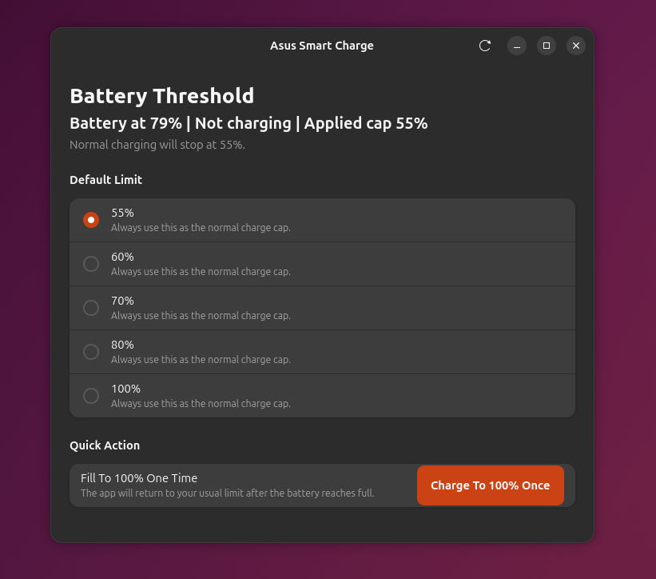

# Asus Smart Charge


Ubuntu desktop app for managing Asus battery charge thresholds with:

- Fixed threshold choices: `55%`, `60%`, `70%`, `80%`, `100%`
- One-time `100%` charging that falls back to the user's normal threshold
- Persistent enforcement after reboot and after suspend/resume
- Local `.deb` packaging with the GUI, helper, systemd units, and policy file

## Local development

Run the GUI from the project directory:

```bash
PYTHONPATH=src python3 bin/asus-smart-charge
```

Run the helper directly:

```bash
PYTHONPATH=src python3 bin/asus-smart-charge-helper status
```

## Build a package

```bash
./build-deb.sh
```
